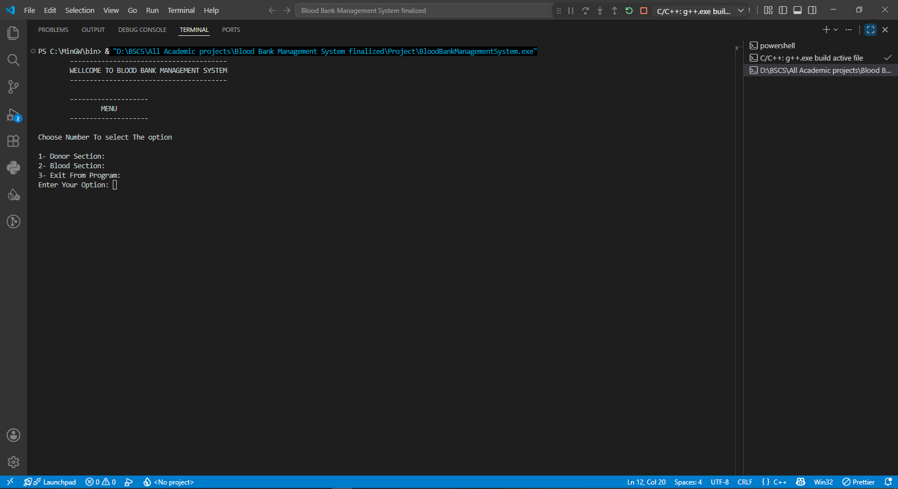
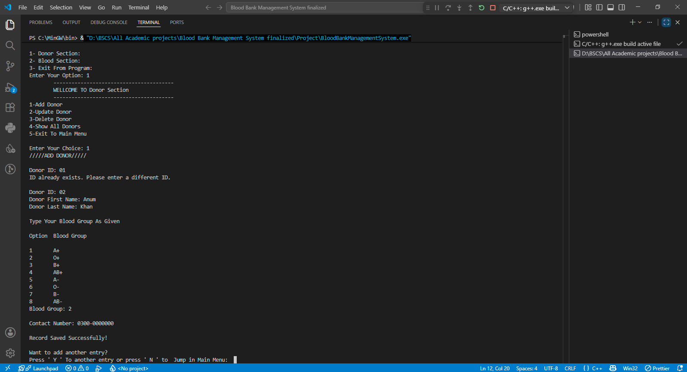
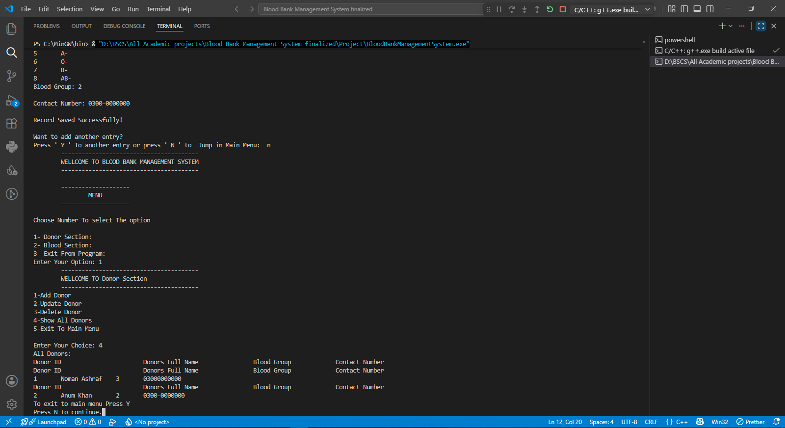
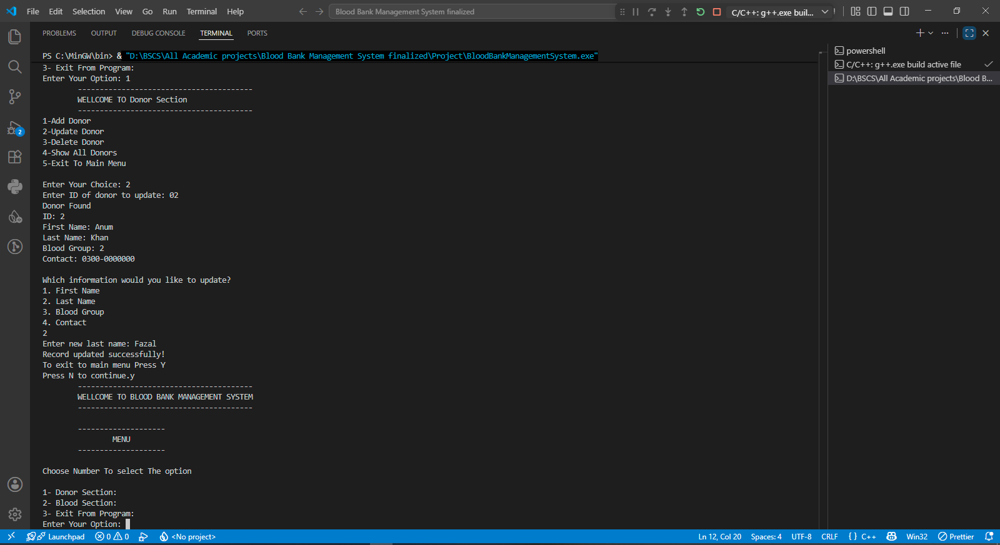
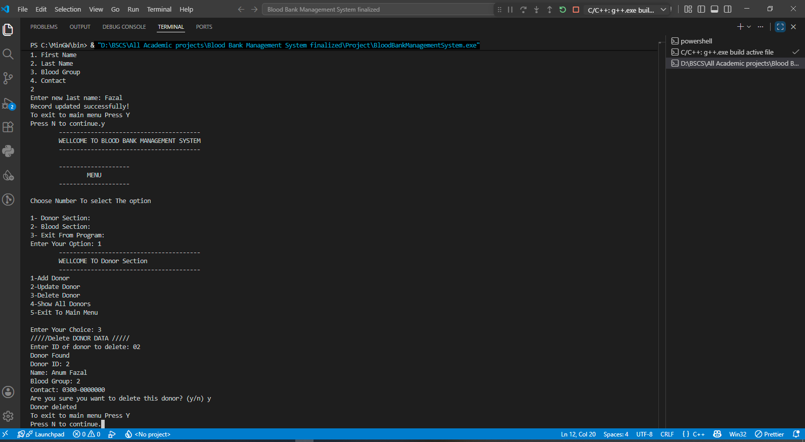
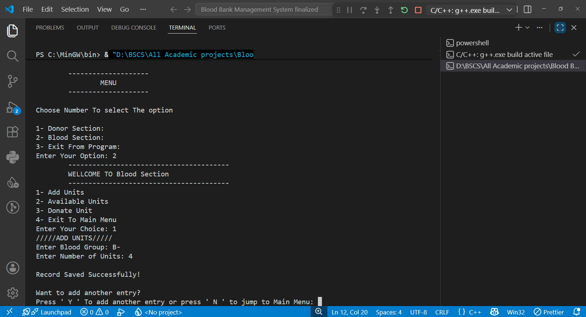
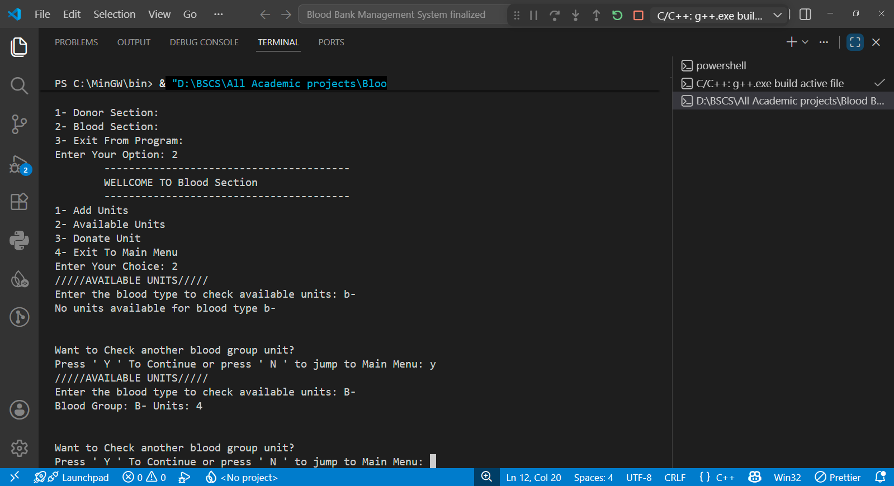
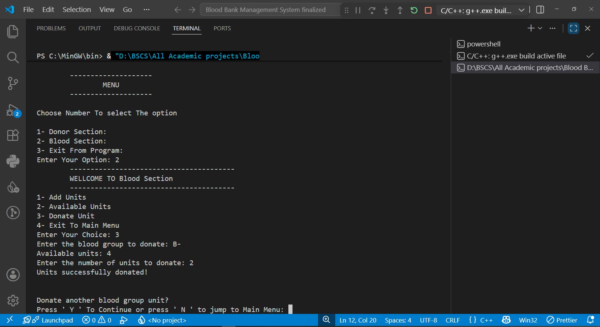
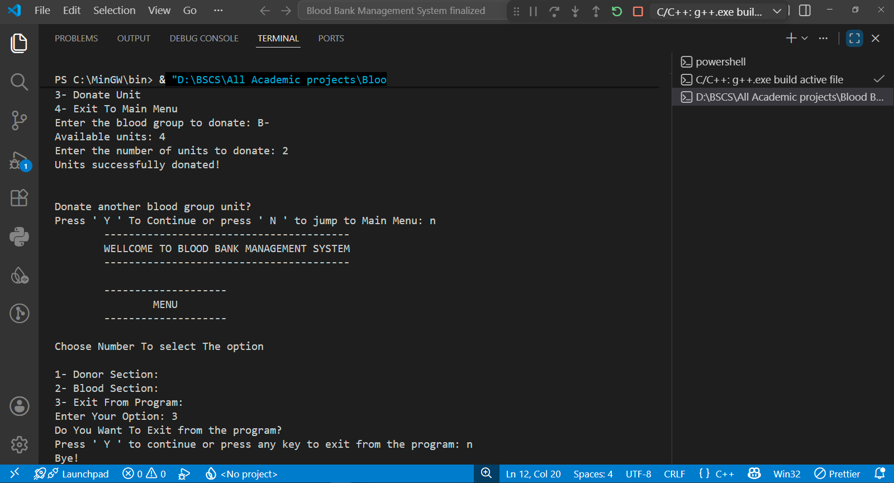

# 🩸 Blood Bank Management System

A console-based **Blood Bank Management System** built in **C++**, using file handling to manage donor records and blood unit inventory. Developed as a first-semester academic project.

## 📋 Overview

The system is split into two main sections — **Donor Management** and **Blood Stock Management** — and performs full CRUD (Create, Read, Update, Delete) operations using flat text files for persistent storage.

## ✨ Features

### Donor Section
- **Add Donor** — Records Donor ID, First Name, Last Name, Blood Group, and Contact Number
- **Update Donor** — Look up a donor by ID and update First Name, Last Name, Blood Group, or Contact
- **Delete Donor** — Look up a donor by ID, display the record, and delete it after confirmation
- **Show All Donors** — Displays every donor record currently stored

### Blood Section
- **Add Units** — Adds blood units for a given blood group to the stock file
- **Available Units** — Looks up and displays the available unit count for a given blood group
- **Donate Units** — Deducts units from stock when blood is issued/donated, updating the file accordingly

### Program Flow
```
Main Menu
│
├── Donor Section
│   ├── Add Donor
│   ├── Update Donor
│   ├── Delete Donor
│   ├── Show All Donors
│   └── Exit
│
├── Blood Section
│   ├── Add Units
│   ├── Available Units
│   ├── Donate Units
│   └── Exit
│
└── Exit Program
```

## 📸 Demo Walkthrough

Below is a step-by-step walkthrough of the program in action, with a screenshot for each operation.

### 1. Main Menu
The program starts by displaying the main menu, letting the user choose between the Donor Section and Blood Section.



### 2. Add Donor
Adds a new donor by collecting their ID, name, blood group, and contact number, then saves the record to `AddDonorDetails.txt`.



### 3. Show All Donors
Displays every donor record currently stored in the system.



### 4. Update Donor
Looks up a donor by ID and lets the user update their first name, last name, blood group, or contact number.



### 5. Delete Donor
Looks up a donor by ID, displays the record, and removes it after confirmation.



### 6. Add Units
Adds blood units for a specified blood group to the stock file.



### 7. Available Units
Checks and displays the number of available units for a given blood group.



### 8. Donate Units
Deducts units from stock when blood is donated/issued, updating the blood unit file.



### 9. Exit Program
Asks for confirmation before exiting, or returns to the main menu.



> 📁 All screenshots are stored in the `screenshots/` folder of this repository.

## 🗂️ Data Storage

The program uses flat text files instead of a database:

| File | Purpose |
|---|---|
| `AddDonorDetails.txt` | Stores all donor records |
| `AddUnitDetails.txt` | Stores blood group unit counts |
| `temp.txt` | Temporary file used during update/delete operations |

## 🧱 Data Structure

```cpp
struct Donor
{
    int id;
    string firstName;
    string lastName;
    string bloodGroup;
    string contact;
};
```

## 🛠️ Concepts Demonstrated

- Functions & modular program design
- Structures (`struct`)
- Switch statements & loops for menu navigation
- File handling (read/write/append)
- String streams (`stringstream`) for data parsing
- CRUD operations (Create, Read, Update, Delete)
- Menu-driven program architecture

## ▶️ How to Run

1. Compile the source file using any standard C++ compiler:
   ```
   g++ BloodBank.cpp -o BloodBank
   ```
2. Run the executable:
   ```
   ./BloodBank
   ```
3. On first run, the program will create `AddDonorDetails.txt` and `AddUnitDetails.txt` automatically as records are added.
4. Navigate using the on-screen numeric menu options.

> Originally developed and tested using Turbo C++ / Dev C++ in a Windows lab environment as part of a first-semester coursework assignment.

## 📌 Sample Menu

```
1- Donor Section
2- Blood Section
3- Exit From Program
```

## 🎓 About

This project was built during my **first semester** of the BS Computer Science program at the **University of Gujrat**, as an introduction to structured programming, file handling, and CRUD-based application design in C++.
